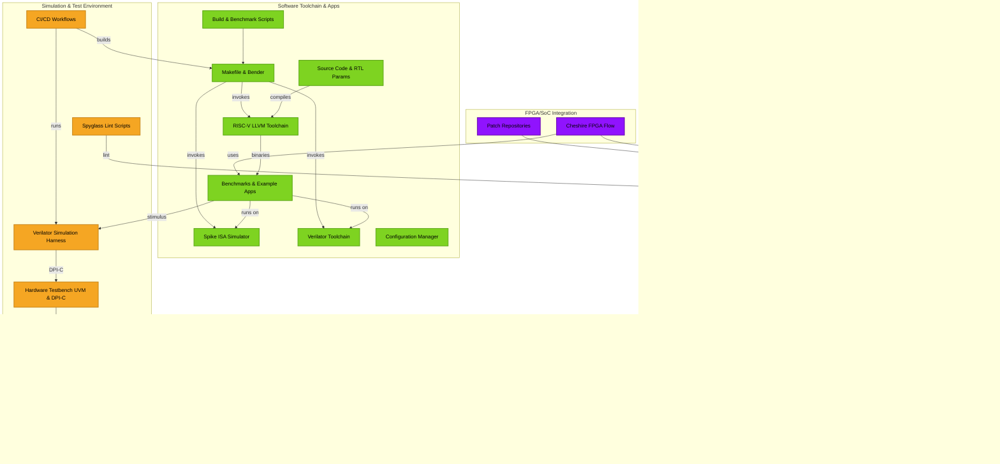

```mermaid
flowchart TB
    %% Hardware Layer
    subgraph "Hardware RTL & Memory" 
        direction TB
        CVA6["CVA6 Scalar Core"]:::external
        AXI_IF["AXI Interface"]:::hardware
        subgraph "Ara Vector Unit"
            direction TB
            AraTop["Ara Top-level RTL"]:::hardware
            Dispatcher["Vector Dispatcher"]:::hardware
            Sequencer["Vector Sequencer"]:::hardware
            Lanes["Lane Array"]:::hardware
            MaskU["Mask Unit"]:::hardware
            SLDU["Segment Sequencer (SLDU)"]:::hardware
            VLSU["Vector LSU"]:::hardware
        end
        L1["L1 Cache"]:::hardware
        L2["L2 Cache"]:::hardware
        DRAM["Main Memory (DRAM)"]:::external
    end

    %% Software Toolchain Layer
    subgraph "Software Toolchain & Apps"
        direction TB
        Source["Source Code & RTL Params"]:::software
        LLVM["RISC-V LLVM Toolchain"]:::software
        Spike["Spike ISA Simulator"]:::software
        Verilator_tc["Verilator Toolchain"]:::software
        Benchmarks["Benchmarks & Example Apps"]:::software
        ConfigMgr["Configuration Manager"]:::software
        Scripts["Build & Benchmark Scripts"]:::software
        Makeflow["Makefile & Bender"]:::software
    end

    %% Simulation & Test Layer
    subgraph "Simulation & Test Environment"
        direction TB
        VerilatorHarness["Verilator Simulation Harness"]:::sim
        TB["Hardware Testbench UVM & DPI-C"]:::sim
        Spyglass["Spyglass Lint Scripts"]:::sim
        CI["CI/CD Workflows"]:::sim
    end

    %% FPGA Integration Layer
    subgraph "FPGA/SoC Integration"
        direction TB
        Cheshire["Cheshire FPGA Flow"]:::fpga
        Patches["Patch Repositories"]:::fpga
    end

    %% Connections
    CVA6 -->|issues vector instrs| AXI_IF
    AXI_IF -->|instrs| Dispatcher
    Dispatcher -->|micro-ops| Sequencer
    Sequencer -->|dispatch| Lanes
    Sequencer -->|control| MaskU
    Sequencer -->|control| SLDU
    Sequencer -->|control| VLSU
    Lanes -->|access| L1
    MaskU -->|access| L1
    SLDU -->|access| L1
    VLSU -->|access| L1
    L1 -->|spill/refill| L2
    L2 -->|to/from| DRAM

    Source -->|compiles| LLVM
    LLVM -->|binaries| Benchmarks
    Benchmarks -->|runs on| Spike
    Benchmarks -->|runs on| Verilator_tc
    Scripts --> Makeflow
    Makeflow -->|invokes| LLVM
    Makeflow -->|invokes| Spike
    Makeflow -->|invokes| Verilator_tc

    Benchmarks -->|stimulus| VerilatorHarness
    VerilatorHarness -->|DPI-C| TB
    TB -->|monitors| L1
    Spyglass -->|lint| AraTop
    CI -->|builds| Makeflow
    CI -->|runs| VerilatorHarness

    Cheshire -->|integrates| AraTop
    Cheshire -->|uses| Benchmarks
    Patches -->|apply| AraTop

    %% Click Events
    click Dispatcher "https://github.com/pulp-platform/ara/blob/main/hardware/src/ara_dispatcher.sv"
    click Sequencer "https://github.com/pulp-platform/ara/blob/main/hardware/src/ara_sequencer.sv"
    click AraTop "https://github.com/pulp-platform/ara/blob/main/hardware/src/ara.sv"
    click AXI_IF "https://github.com/pulp-platform/ara/blob/main/hardware/src/axi_inval_filter.sv"
    click Lanes "https://github.com/pulp-platform/ara/tree/main/hardware/src/lane/"
    click MaskU "https://github.com/pulp-platform/ara/tree/main/hardware/src/masku/"
    click SLDU "https://github.com/pulp-platform/ara/tree/main/hardware/src/sldu/"
    click VLSU "https://github.com/pulp-platform/ara/tree/main/hardware/src/vlsu/"
    click CVA6 "https://github.com/pulp-platform/ara/tree/main/cheshire/"
    click VerilatorHarness "https://github.com/pulp-platform/ara/blob/main/hardware/tb/verilator/ara_tb.cpp"
    click Spyglass "https://github.com/pulp-platform/ara/tree/main/hardware/spyglass/"
    click Benchmarks "https://github.com/pulp-platform/ara/tree/main/apps/"
    click ConfigMgr "https://github.com/pulp-platform/ara/tree/main/config/"
    click Makeflow "https://github.com/pulp-platform/ara/tree/main/Makefile"
    click LLVM "https://github.com/pulp-platform/ara/tree/main/toolchain/riscv-llvm/"
    click Spike "https://github.com/pulp-platform/ara/tree/main/toolchain/riscv-isa-sim/"
    click Verilator_tc "https://github.com/pulp-platform/ara/tree/main/toolchain/verilator/"
    click Scripts "https://github.com/pulp-platform/ara/tree/main/scripts/"
    click Cheshire "https://github.com/pulp-platform/ara/tree/main/cheshire/"
    click CI "https://github.com/pulp-platform/ara/blob/main/.github/workflows/ci.yml"
    click Patches "https://github.com/pulp-platform/ara/tree/main/patches/"
    click TB "https://github.com/pulp-platform/ara/tree/main/hardware/tb/"

    %% Enhanced Color Styles
    classDef hardware fill:#4A90E2,stroke:#2E5C8A,stroke-width:2px,color:#000000
    classDef software fill:#7ED321,stroke:#5BA617,stroke-width:2px,color:#000000
    classDef sim fill:#F5A623,stroke:#C7851A,stroke-width:2px,color:#000000
    classDef fpga fill:#9013FE,stroke:#6A0DAD,stroke-width:2px,color:#000000
    classDef external fill:#50E3C2,stroke:#3BA896,stroke-width:2px,color:#000000
```